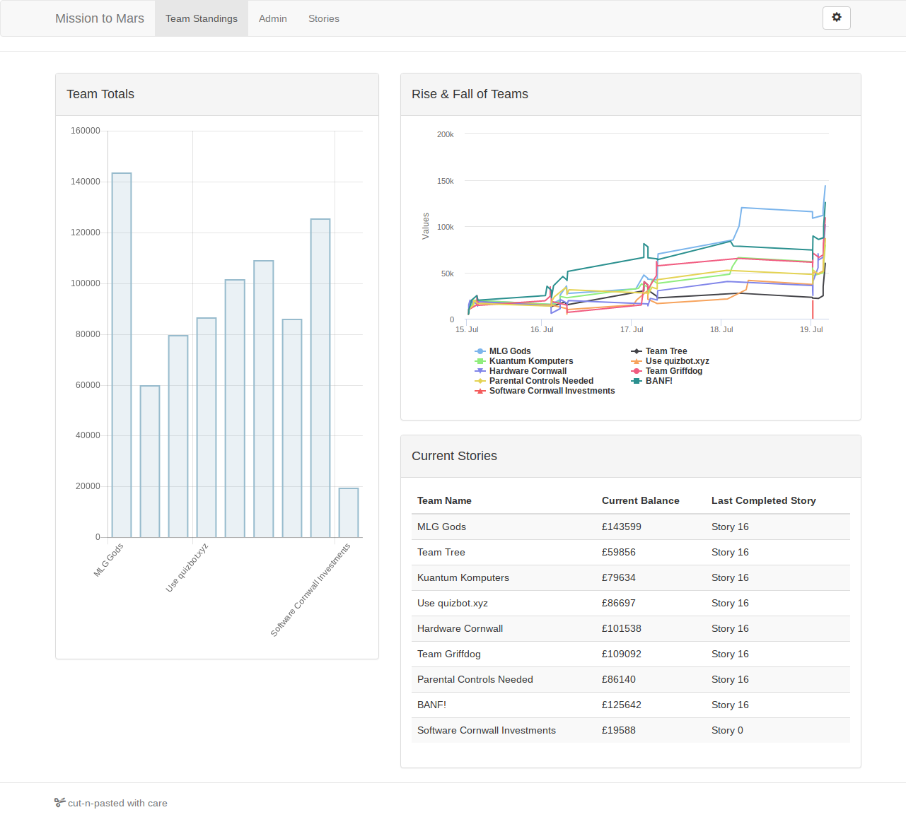

# Missio to Mars: Work Experience - July 2019

Code created at the Mission to Mars Summer Work Experience in July 2019, hosted at Heartlands, Pool. Participants were given the support of a team of mentors from local education and businesses and tasked to complete the provided manoeuvrability challenges.

## Results
The challenges come with a Core Coin reward, with the prizes being totted up via
the teams dashboard.

The results were:

1. MLG Gods                      - $143,599
2. BANF!                         - $125,642
3. Team Griffdog                 - $109,092
4. Hardware Cornwall             - $101,538
5. Use [quizbot.xyz](https://quizbot.xyz/)       - $86,697
6. Parental Controls Needed      - $86,140
7. Kuantum Komputers             - $79,634
8. Team Tree                     - $59,856
9. Software Cornwall Investments - $19,588

## Usage Instructions
Clone the project locally and check out the various .ino files.
